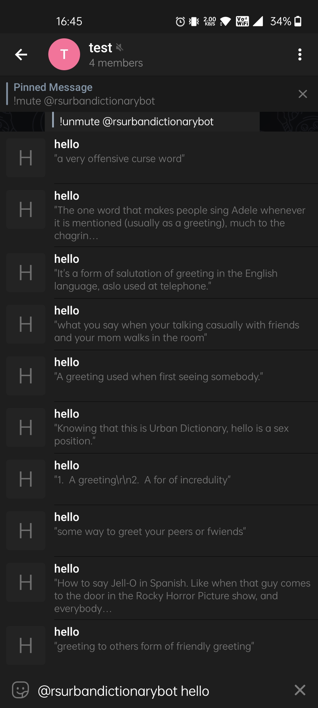
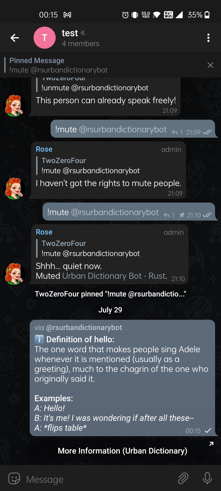
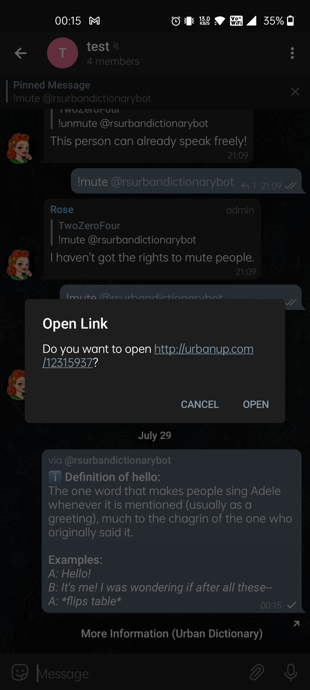
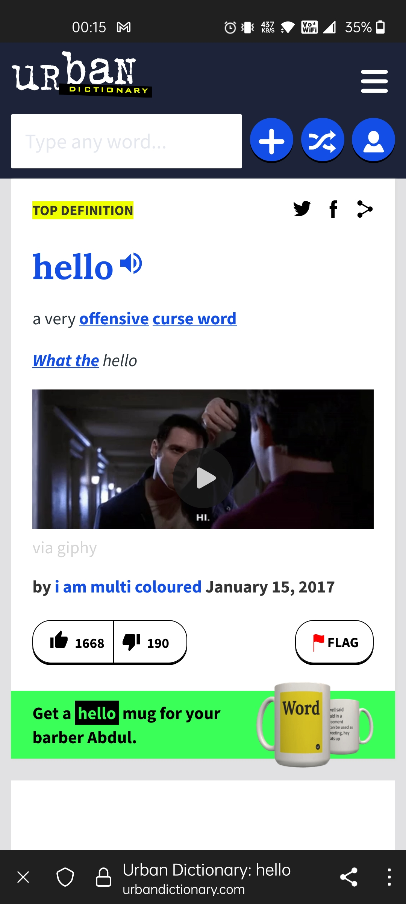
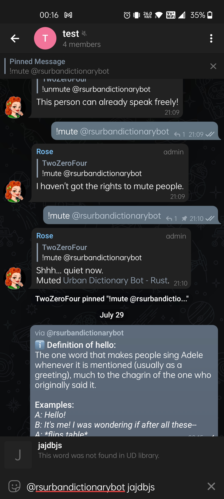

## Build Information
```
Name: udbot
Version: 0.1.0
Author: idkwhoiam322
Description: A Telegram bot that gets word definitions from Urban Dictionary
Repository: https://github.com/idkwhoiam322/udbot
Associated Channel: None
```

## How to use?
```
Ensure all of the following are set in your environment:
    - TELOXIDE_TOKEN = Telegram Bot token from t.me/BotFather
```

## Image Preview:
#### Valid Search Query
<p align="left">

&nbsp;&nbsp;&nbsp;&nbsp;&nbsp;&nbsp;

<br>
<br>
</p>

#### Valid Search Query Button Usage
<p align="left">

&nbsp;&nbsp;&nbsp;&nbsp;&nbsp;&nbsp;

<br>
<br>
</p>

#### Invalid Search Query
<p align="left">

&nbsp;&nbsp;&nbsp;&nbsp;&nbsp;&nbsp;

</p>

Contact me: [Telegram](https://t.me/idkwhoiam322)
