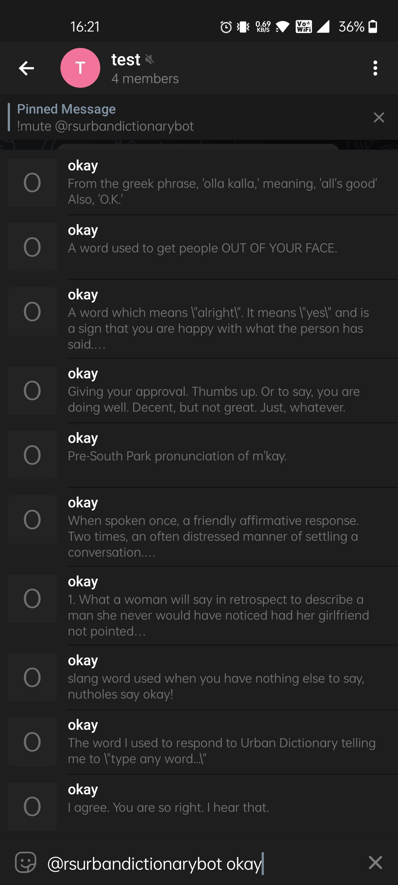
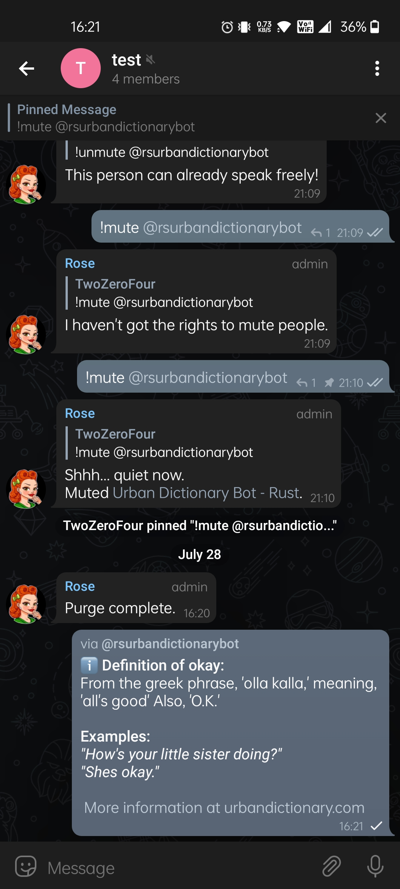

## Build Information
```
Name: udbot
Version: 0.1.0
Author: idkwhoiam322
Description: A Telegram bot that gets word definitions from Urban Dictionary
Repository: https://github.com/idkwhoiam322/udbot
Associated Channel: None
```

## How to use?
```
Ensure all of the following are set in your environment:
    - TELOXIDE_TOKEN = Telegram Bot token from t.me/BotFather
```

## Image Preview:
<p align="center">

<br>
<br>

<br>
<br>

<br>
<br>

</p>

Contact me: [Telegram](https://t.me/idkwhoiam322)
